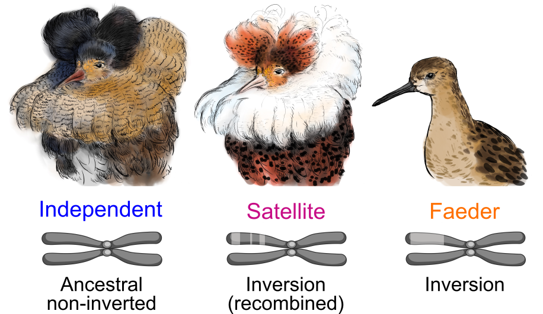

 

#  A single gene orchestrates androgen variation underlying male mating morphs in ruffs

This repository contains the data files, metadata, data processing scripts, data analysis scripts, and plotting scripts used in:

**J. L. Loveland, A. Zemella *et al.*, (2024) *A single gene orchestrates androgen regulation underlying alternative mating morphs in ruffs* [in revision]**

## Before You Start
Due to Git repository size limitations, some large files (exceeding 500 MB) are not included here. To fully reproduce all data analyses from this study, please download the following external files and place them in the specified folders:

### GitHub Repository Download:
Clone this GitHub repository by typing in the command line:
- git clone https:<n/>//github.com/azemella/Ruff_adults_RNASeq_gene_expression_2024
- Rename the folder as 'ruff_adults_gene_expression'. This will be the working directory.

### *Calidris pugnax* (Ruff) Reference Genome Assembly [GCF_001431845.1](https://www.ncbi.nlm.nih.gov/datasets/genome/GCF_001431845.1/) and Related Files
1. **Genome Assembly Files**:
   - **FASTA file**: Download to `./snakemake/genome/ncbi_genome/` and rename as `GCF_001431845.1_ASM143184v1_genomic.fna`.
   - **FASTA index file**: Download to `./snakemake/genome/ncbi_genome/` and rename as `GCF_001431845.1_ASM143184v1_genomic.fna.fai`.
   - **Genome annotation GTF file**: Download to `./snakemake/genome/ncbi_genome/` and rename as `GCF_001431845.1_ASM143184v1_genomic.gtf`.
   - **Save a second copy of the GTF file** in `./metadata/` and rename it as `NCBI_RefSeq_annotation.gtf`.
   - **Genome annotation GFF3 file**: Download to `./snakemake/genome/ncbi_genome/` and rename as `GCF_001431845.1_ASM143184v1_genomic.gff`.
   - **Proteome FASTA file**: Download to `./eggNOG-mapper/` and rename as `GCF_001431845.1_ASM143184v1_proteome.faa`.
### RNA-Sequencing Libraries from [NCBI BioProject 1099138](https://www.ncbi.nlm.nih.gov/bioproject/1099138)
- Download all 238 RNA-Seq libraries used in this study to `./snakemake/data/`.
- Ensure that the file names match those listed in the first column of the data frame `./metadata/metadata.csv`.
### Custom Ruff BSgenome for Use in karyoploteR
Currently, there is no full genome representation for *Calidris pugnax* on [BSGenome](https://kasperdanielhansen.github.io/genbioconductor/html/BSgenome.html), an R package for generating Biostrings-based genome data packages. To replicate the plots in Figure 1C–E using *karyoploteR*, we created a custom ruff BSgenome using the `forgeBSgenomeDataPkg()` function, as described in [this tutorial](https://www.bioconductor.org/packages/release/bioc/vignettes/BSgenome/inst/doc/BSgenomeForge.pdf). The following files are needed:
1. A 2Bit ruff genome sequence file named `CalidrisPugnax.dna.2bit`.
2. A BSgenome data package seed file named `BSgenome.Cpugnax.NCBI.GCF_001431845.1-seed`, which can be found in `./others/`.
To generate the custom BSgenome package, follow the instructions on page 9 of the tutorial, then install it in R as a package.

### Ruff Gene Ontology (GO) Annotations for Functional Enrichment Analysis
Currently, no functional annotations are available for *Calidris pugnax* genes in public databases. However, functional gene annotations can be inferred from orthologs using the online tool [eggNOG-mapper](http://eggnog-mapper.embl.de/).

#### Steps to Generate Functional Annotations
1. **Using eggNOG-mapper**:
   - Upload the file `GCF_001431845.1_ASM143184v1_proteome.faa` from `./eggNOG-mapper/` to eggNOG-mapper (Proteins).
   - Enter your email address and set the taxonomic scope to 'Vertebrata - 7742' in the annotation options.
   - Move all eggNOG-mapper output files to `./eggNOG-mapper/eggNOG_functional_annotations/`.
   - The primary output file for downstream analysis is named `out.emapper.annotations.csv`.
2. **Download Gene and Transcript Annotations**:
   - Download gene annotations from [NCBI Datasets](https://www.ncbi.nlm.nih.gov/datasets/gene/GCF_001431845.1/) and save them to `./metadata/`, renaming the file as `ncbi-gene-dataset.csv`.
   - Download transcript annotations from the same link and save them to `./metadata/`, renaming the file as `ncbi-transcript-dataset.csv`.

#### Creating a Custom Ruff Org.Db Object
To store all downloaded information in a custom *Calidris pugnax* Org.Db object, use the `makeOrgPackage()` function from the R package *AnnotationForge* as described in [this tutorial](https://bioconductor.org/packages/release/bioc/vignettes/AnnotationForge/inst/doc/MakingNewOrganismPackages.html).
1. Run the R script `create_files_for_makeorgdb.R` located in `./makeorgdb/scripts/` to generate the necessary input files.
2. Run the R script `makeorgdb.R`, also in `./makeorgdb/scripts/`, to create the *Calidris pugnax* Org.Db object required for GO functional enrichment analysis using *clusterProfiler*.

### Molecular Docking and Binding Affinity pipeline
This pipeline comprises the following steps:
1. **[AlphaFold2-Multimer](https://colab.research.google.com/github/sokrypton/ColabFold/blob/main/AlphaFold2.ipynb)**: Generate the reference HSD17B2 protein structure for the Independent morph.
2. **[PyMOL](https://pymol.org/)**: Introduce mutations to create models for the Satellite and Faeder morphs.
3. **[pdb-tools](https://www.bonvinlab.org/pdb-tools/)** and **[HADDOCK](https://rascar.science.uu.nl/haddock2.4/)**: Perform first round of molecular docking.
4. **[Maestro](https://www.schrodinger.com/platform/products/maestro/)**: Manual fitting and minimization.
5. **[Haddock-tools](https://github.com/haddocking/haddock-tools)** and **[HADDOCK](https://rascar.science.uu.nl/haddock2.4/)**: Perform second round of molecular docking.
6. **[Prodigy](https://rascar.science.uu.nl/prodigy/)**: Predict binding affinity for the final models.

#### Steps to Replicate the Analysis
- Locate the input FASTA sequence in `./molecular_docking_analysis/1_AlphaFold_Multimer_predicted_homodimer/`.
- Copy the truncated protein sequence of HSD17B2 and paste it in the `"query_sequence"` field at the beginning of the *AlphaFold2-Multimer* notebook.
  - **Tip**: To model a homodimeric structure, paste the sequence twice, separated by a colon (`:`).
- Run the notebook with the default settings. The output will be saved in `./molecular_docking_analysis/AlphaFold_predicted_structures/`. The final model for the Independent morph is also available in this folder.
- Generate the Satellite and Faeder models by using PyMOL’s 'Mutagenesis' tool as demonstrated in [this tutorial](https://www.bing.com/videos/riverview/relatedvideo?&q=mutagenesis+tool+PyMOL&&mid=864C8C96D09FE8B5F3BC864C8C96D09FE8B5F3BC&mmscn=mtsc&aps=130&FORM=VRDGAR).
- Use *pdb-tools* to prepare input PDB files for molecular docking in *HADDOCK2.4*, following the instructions provided [here](https://www.bonvinlab.org/software/haddock2.4/pdb/). The processed models are saved in `./molecular_docking_analysis/2_ruff_HSD17B2_homodimer_structures/`.
- Download canonical testosterone (ID: 6013) and nicotinamide adenine dinucleotide (NAD+ conformer #7, ID: 5892) as SDF files from the [NCBI PubChem database](https://pubchem.ncbi.nlm.nih.gov/).
  - Use *pdb-tools* to convert and prepare ligand files as PDB files. The ‘clean’ ligand PDB files can be found in `./molecular_docking_analysis/3_ligand_structures/`.
- Run *HADDOCK2.4* for molecular docking, using the default settings optimized for protein-ligand docking and bioinformatics predictions. When prompted, provide the `Ambiguous_restraints.tbl` and `Unambiguous_restraints.tbl` files to specify interacting residues. These files are located in `./molecular_docking_analysis/4_HADDOCK_first_run`.
  - **Note**: Since *HADDOCK2.4* produces extensive output, only the top four models from the best-scoring cluster for each morph are stored in `./molecular_docking_analysis/4_HADDOCK_first run/HADDOCK_best_clusters/`.
- Use *Maestro* to manually fit nicotinamide adenine dinucleotide (NAD+) based on high-resolution x-ray experimental structures of other short-chain dehydrogenases. Run the protein preparation workflow with a maximum allowed RMSD change of 0.6 Å, including all atoms. Then, perform minimization to refine hydrogens atoms.
   - The final models generated with *Maestro* and used as input for the *HADDOCK2.4+PRODIGY* pipeline are stored in `./molecular_docking_analysis/5_Final_models`.
- Use the python script *restrain_ligand.py* to create unambiguous distance restraints files for each morph to keep both ligands in place during the semi-flexible refinement step in *HADDOCK2.4*.
- Run *HADDOCK2.4* for molecular docking, using the default settings optimized for protein-ligand docking and bioinformatics predictions. We provided the newly generated unambiguous restraints files and performed refinement with short molecular dynamics simulations.
  - **Note**: To keep the complex fixed in its original positions while allowing the ligands to explore alternative conformations in the binding pocket, enable parameter *"Fix molecule at its original position during it0?"*.
- For downstream binding affinity predictions using *PRODIGY*, we visually inspected all models from the best-scoring cluster and selected those whose ligand binding poses most closely matched those observed in the experimentally validated structures mentioned earlier.
- Finally, use the *PRODIGY-LIGAND* mode in *PRODIGY* to predict the binding affinities towards both ligands of the selected *HADDOCK2.4* models.
   - The selected *HADDOCK2.4* models and binding affinity results are documented in `./molecular_docking_analysis/6_Binding_affinity_PRODIGY`.

### Note:
To comply with the journal's guidelines, some adjustments (e.g., font size for axis titles and legend labels) were made to a few plots after they were initially generated in R. These edits were done using Inkscape. We provide SVG files for both the original and edited versions.
